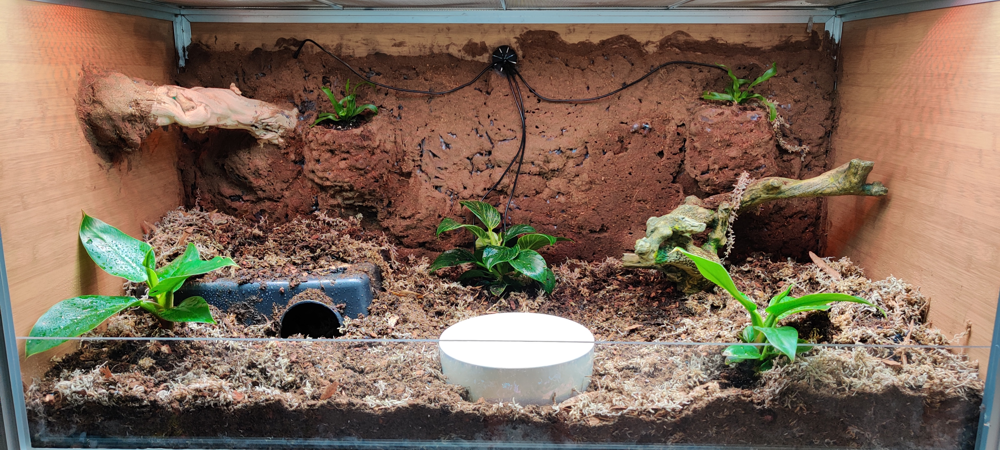

<h1> Planet Snake </h1>

<h2  > Description </h2>

This is project is a Raspberry Pi controlled eco system. It monitors the temperatures inside the Vivarium creating a temperature gradient throughout. This helps to provide Sunny a warm place to hide, a cool place to hide as well as a basking spot that will roast like the sun.

Sunny is our intrepid but stealthy snake. She goes up, she goes down, she goes all around. Sunny loves the sun! Thats why Planet Snake also features lighting control. Thats right, during the day she gets healthy dose of UVB as well as extra LED lights targeted towards plant growth and health. During the evening it has a nice healthy blue glow for moon light.

<h2>Hardware</h2>

This enclosure runs on a Raspberry Pi Zero W.

This enclosure utilizes 4 sets of 4 mechnical opto-isolated relays. One for the lights and one for heating.

<h3>Heating</h3>

Currently utilizing 3 of an available 6 connected relays recycled from a previous project. Final build will we be updated to solid state relays to reduce noise and increase reliability. It will also be updated to a sleeker 3D Printed Enclosure.

TODO - Update to Solid State Relays to add reliablity and remove clicking noise when trigger relay.

Running

This is should be run as a PM2 instance to run at all times.

Currently building
